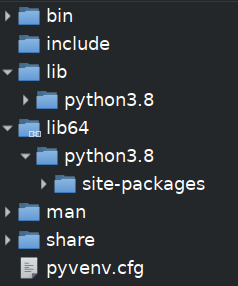
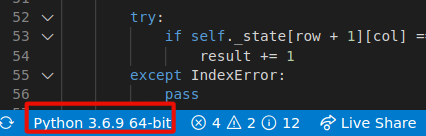
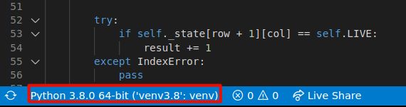

# Trabajando con Python3 en entornos virtuales (venv)

Como desarrolladores de Python, es habitual que tengamos que trabajar en diferentes proyectos. Cada proyecto puede tener una serie de dependencias, diferentes versiones de paquetes, diferente versión de Python, etc...

Una forma habitual de lidiar con los requisitos de versionado, es trabajar con entornos virtuales, también conocidos como _venv_.

Para poder trabajar con entornos virtuales, es necesario tener instalado el [paquete _venv_ de Python3](https://docs.python.org/3/library/venv.html#module-venv), el cual podemos instalar, por ejemplo ([doc](https://packaging.python.org/guides/installing-using-pip-and-virtual-environments/)):

```Shell
╭─[serfer2] as serfer2 in ~
╰──➤ python3 -m pip install --user --upgrade pip
╭─[serfer2] as serfer2 in ~
╰──➤ python3 -m pip install --user virtualenv
```


## ¿Qué es un entorno virtual de Python?

Un venv de Python es una instalación de Python aislada. Es decir, una carpeta con los binarios de la versión de Python elegida y las librerías (paquetes) instalados en la misma.

La estructura típica de la carpeta de un entorno virtual será algo como esto:



No entraremos en detalle para explicar todas las carpetas. Nos centraremos en las de `bin` y `lib`. 

- **bin**:  Esta carpeta contiene los binarios de la versión de Python que usaremos, los scripts para activar/desactivar el entorno virtual y el ejecutable del gestor de paquetes de Python `pip`.

- **lib** (y lib64):  Contiene los paquetes que hayamos añadido a nuestro entorno virtual.


## Creación de entornos virtuales

En general, creamos un entorno virtual con el siguiente comando:

```Shell
╭─[serfer2] as serfer2 in ~
╰──➤ python3 -m venv /ruta/absoluta/a/la/carpeta/del/nuevo/venv
```
**NOTA**:  
Este comando creará un entorno virtual de Python con la misma versión de Python3 que tengamos instalada por defecto en nuestro sistema.  
Para comprobar la versión de Python que tenemos instalada por defecto:  

```Shell
╭─[serfer2] as serfer2 in ~
╰──➤ python3 --version
Python 3.6.9
```


## ¿Podemos crear entornos virtuales con versiones diferentes de Python?

**Si**. Veámoslo con un ejemplo:

Imaginemos que nuestro sistema tiene instalada, por defecto, la versión de Python3 `v3.6.9` y queremos crear un nuevo entorno virtual con la versión `3.8.0`.
El siguiente ejemplo es para una Ubuntu 18.04. Los pasos a seguir serán:

- Instalar los binarios de la versión 3.8.0 en nuestro sistema.
```Shell
╭─[serfer2] as serfer2 in ~
╰──➤ sudo apt-get install python3.8 python3.8-venv
```

- Crear un entorno virtual usando esos binarios de Python3 v3.8.0
```Shell
╭─[serfer2] as serfer2 in ~
╰──➤ python3.8 -m venv /ruta/absoluta/a/la/carpeta/del/nuevo/venv
```

**NOTA**:  
Para Windows y Mac, la mecánica es la misma. Descargamos los binarios de la versión de Python que nos interesa y los usamos para crear un entorno virtual.


## Activar y desactivar el entorno virtual

Para poder empezar a trabajar con entornos virtuales, desde la shell, primero debemos activarlos.  

Para activar el entorno virtual y trabajar con él, no es necesario estar en la carpeta que lo contiene. Basta ejecutar el script `activate` de la carpeta` bin/` de nuestro entorno virtual:

```Shell
╭─[serfer2] as serfer2 in ~
╰──➤ source /ruta/absoluta/a/la/carpeta/del/nuevo/venv/bin/activate
```

Para salir o desactivar el entorno virtual ejecutamos el comando deactivate (a secas):

```Shell
╭─[serfer2] as serfer2 in ~
╰──➤ deactivate
```

**TIP**:  
El script `bin/activate`  de nuestro entorno virtual, nos permite personalizar la activación/desactivación del mismo.  
Por ejemplo, podemos añadir/quitar variables de entorno, modificar el PYTHONPATH, etc...

Para eliminar un entorno virtual, basta con eliminar la carpeta que lo contiene.


## Añadir paquetes a un entorno virtual.

Supongamos que hemos creado un entorno virtual en la carpeta `/home/serfer2/venv3.8` y queremos añadir algunos paquetes que vamos a usar en nuestro desarrollo, como por ejemplo [requests](https://pypi.org/project/requests/).  
Bastaría con activar nuestro entorno virtual (si no lo hemos hecho ya) e instalar el paquete. Ejemplo:

```Shell
╭─[serfer2] as serfer2 in ~
╰──➤ source /home/serfer2/venv3.8/bin/activate

╭─[serfer2] as serfer2 in ~
╰──➤ (venv3.8)  pip install requests                   
Collecting requests
  Downloading https://files.pythonhosted.org/packages/45/1e/0c169c6a5381e241ba7404532c16a21d86ab872c9bed8bdcd4c423954103/requests-2.24.0-py2.py3-none-any.whl (61kB)
  ... 
```

Al tener activado el entorno virtual, el gestor de paquetes `pip` que estamos usando es del venv en `/home/serfer2/venv3.8/bin/pip` y el paquete se habrá instalado en `/home/serfer2/venv3.8/lib/python3.8/site-packages/`.

Al instalar paquetes en un entorno virtual, dado que está aislado del resto, no modificamos la configuración de nuestro sistema ni la de otros entornos virtuales.  

Esta es una de las principales ventajas de los entornos virtuales: podemos instalar, eliminar y gestionar las versiones de los paquetes, de cada proyecto, sin interferir unos con otros.

## ¿Puedo usar el entorno virtual en mi editor o en mi IDE?

**SI**. Es recomendable que configures tu editor o IDE para trabajar con el entorno virtual que vayas a utilizar en el proyecto.

Supongamos que hemos creado un entorno virtual para trabajar en un desarrollo. La carpeta en la que lo hemos creado es: `/home/serfer2/venv3.8`.


### - Configurar VSC (Visual Studio Code) para un entorno virtual de Python

Existen muchos manuales sobre como configurar VSC para trabajar con entornos virtuales de Python. Podemos resumir una forma rápida de configurarlo tal que:

- Abrimos la carpeta del proyecto en VSC, vamos a la barra de estado y hacemos click en la versión del intérprete que nos muestre:



- En el pop-up que aparece, podemos seleccionar alguno de los venv que ya hayamos usado anteriormente o añadir el que acabamos de crear haciendo click en la opción _"Enter a interpreter path"_.  
En nuestro caso, elegimos esa opción y seleccionamos el ejecutable de Python de nuestro venv (`/home/serfer2/venv3.8/bin/python`).  
Una vez seleccionado el ejecutable, la barra de estado nos muestra que estamos usando el entorno virtual deseado:



A partir de ese momento, tanto el intérprete de Python como los paquetes instalados en nuestro venv, son accesibles para VSC.


### - Configurar ST3 (Sublime Text 3) para un entorno virtual de Python

Bastará con editar/crear la configuración para el proyecto en el que vamos a trabajar e incluir las opciones `python_interpreter` y el `PYTHONPATH` dentro de `env`, ambos en la sección general `settings`:

```
{
  "settings": {
    "python_interpreter": "/home/serfer2/venv3.8/bin/python",
    "env": {
      "PYTHONPATH": "/home/serfer2/venv3.8/lib/python3.8/site-packages",
    },
  ...

```

Muchos otros editores e IDEs, como PyCharm o Atom, tienen capacidad para configurar entornos virtuales.


## Bonus track:  Virtualenvwrapper, one tool to rule 'em all

Si bien el uso de entornos virtuales no es demasiado complicado, es posible que acabemos teniendo un buen número de ellos desperdigados por el árbol de directorios de nuestro sistema.

Por otro lado, no es cómodo tener que estar tecleando los comandos para activarlos y es posible que no recordemos en qué carpetas los tenemos.

Afortunadamente disponemos de [virtualenvwrapper](https://pypi.org/project/virtualenvwrapper/). Sus principales características son:

- Organiza todos los venv dentro de una misma carpeta en nuestro sistema.
- Proporciona comandos sencillos para crear, copiar y eliminar nuestros venv.
- Cambio rápido entre entornos virtuales, con un solo comando.
- Hooks de usuario, configurables, para todas las operaciones.
- Sistema de plugins para crear/compartir extensiones para gestión de entornos virtuales.

### Ejemplo:

Supongamos que queremos crear un nuevo entorno virtual, con Python 3.8.0.  
En nuestro caso, el ejecutable con la versión 3.8 de Python  la tenemos instalada en `/usr/bin/python3.8` de nunestro sistema.  
Bastaría con usar el comando `mkvirtualenv`:

```Shell
╭─[serfer2] as serfer2 in ~
╰──➤ mkvirtualenv -p /usr/bin/python3.8 mi-nuevo-venv-3.8
```

Todos los venv creados con _Virtualenvwrapper_ se crean, por defecto, dentro del directorio del usuario, en la carpeta oculta `.virtualenvs`.  
En nuestro caso será en `/home/serfer2/.virtualenvs/mi-nuevo-venv-3.8`.  

Para activar el nuevo entorno virtual, basta con usar el comando `workon` sin importar el path en el que estemos y sin tener que recordar el path en el que el venv se creó:

```Shell
╭─[serfer2] as serfer2 in ~
╰──➤ workon mi-nuevo-venv-3.8
```

Para desactivarlo, usamos el comando `deactivate`, como siempre:

```Shell
╭─[serfer2] as serfer2 in ~
╰──➤ (mi-nuevo-venv-3.8)  deactivate
```

La herramienta Virtualenvwrapper tiene multitud de funcionalidades y atajos para gestionar entornos virtuales de Python. Vale la pena echarle un vistazo a la [documentación](https://virtualenvwrapper.readthedocs.io/en/latest/)


## Referencias

[Guía de instalación y uso de entornos virtuales](https://packaging.python.org/guides/installing-using-pip-and-virtual-environments/)

[Documentación del paquete venv de Python3](https://docs.python.org/3/library/venv.html#module-venv)

[Virtualenvwrapper (Documentación)](https://virtualenvwrapper.readthedocs.io/en/latest/)

[Virtualenvwrapper (paquete)](https://pypi.org/project/virtualenvwrapper/)
